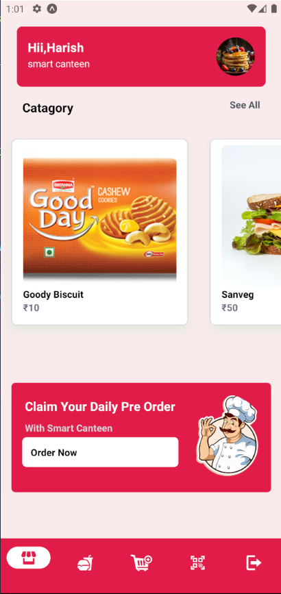

# Smart Canteen

Smart Canteen is a comprehensive solution for managing canteen services. It includes a mobile app, web interface, and API. The mobile app is built with React Native, the web interface is built with Next.js, and the API is built with Express. The application uses MongoDB for database services and Firebase for authentication and cloud storage. The UI is styled with Tailwind CSS.


## Tech Stack

- Mobile App: React Native
- Web Interface: Next.js
- API: Express.js
- Database: MongoDB
- Authentication and Cloud Storage: Firebase
- Styling: Tailwind CSS

## Mobile App

The mobile app is built with React Native. It allows users to claim their daily pre-orders and manage their account.

## Web Interface

The web interface is built with Next.js. It provides a comprehensive dashboard for managing canteen services.

## API

The API is built with Express.js. It provides endpoints for managing users, orders, and other canteen services.

## Database

The application uses MongoDB for storing user data, order data, and other canteen service data.

## Authentication and Cloud Storage

The application uses Firebase for user authentication and cloud storage.

## Styling

The UI for both the mobile app and the web interface is styled with Tailwind CSS.

## Getting Started

To get started with Smart Canteen, clone the repository and install the dependencies:

```bash
git clone https://github.com/yourusername/smart-canteen.git
cd smart-canteen
npm install